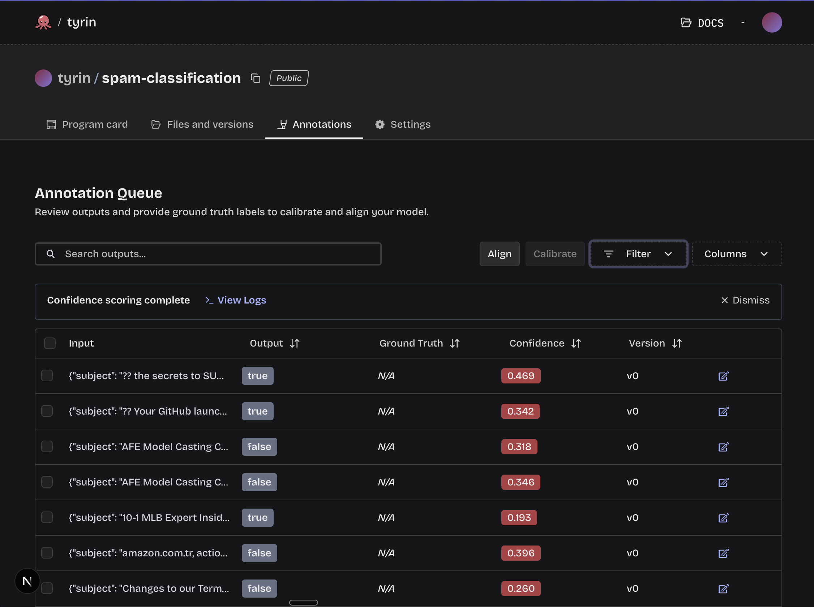

# Spam Classification

This is a walk through of using an arbiter to classify emails as spam or not spam.

## Step 1. Create Arbiter
Create an arbiter and push it to Modaic Hub

[arbiter.py](./arbiter.py)
```python
import dspy
import modaic


class SpamClassifier(dspy.Signature):
    # The docstring of the dspy.Signature will be used in the system prompt of the Arbiter
    """Classify the email as spam or not spam."""
    
    # Define input fields
    subject: str = dspy.InputField()
    body: str = dspy.InputField()
    
    # Define output field
    is_spam: bool = dspy.OutputField(desc="Whether the message is spam or not spam.")


# Create a an Arbiter by initializing a modaic.Predict with the defined Signature and using .as_arbiter
classifier = modaic.Predict(
    SpamClassifier, lm=modaic.SafeLM(model="together_ai/openai/gpt-oss-120b")
).as_arbiter()

# Lets run a quick example offline to see how the predict classifies an example
result = classifier(
    subject="You won a free flight to paris",
    body="Dear Sir or Madam, \n We have been trying to contact you regarding your car's extended warranty",
    return_messages=True,
)
print("Is Spam:", result.is_spam)
print("Messages:", result._messages)
print("Outputs:", result._outputs)

# Push arbiter to modaic hub (replace <username> with your modaic username)
classifier.push_to_hub("<username>/spam-classification")
```

Now run the script
```bash
uv run arbiter.py
```

## Step 2. Run Your Arbiter on Modaic Hub via API

[predict.py](./predict.py)
```python
from datasets import load_dataset
from modaic import Arbiter

dataset = load_dataset("UniqueData/email-spam-classification")["train"]

# User Arbiter to run your arbiter via modaic's backend (make sure you have set a TOGETHER_API_KEY in Settings > Environment Variables)
# # Replace <username> with your username
arbiter = Arbiter("<username>/spam-classification")


def add_prediction(row):
    result = arbiter.predict(subject=row["title"], body=row["text"])
    row["predicted"] = result.output.is_spam
    return row


# Map over the hf dataset getting a prediction for each row
dataset = dataset.map(add_prediction)

dataset.save_to_disk("predictions")
```

Now run the script
```bash
uv run predict.py
```

## Step 3. Confidence Scoring

After running the arbiter you can run a `Calibrate` job on Modaic Platform to calculate confidence scores for each prediction.

Find the repository `spam-classification` in your profile page. Then navigate to the `Annotations` tab and press the `Calibrate` button. This may take a few minutes. When its done you should see confidence scores.



## Optional. Compute Confidence Scores Online via SDK

If you want to see confidence as soon as you get the prediction, you can use the `.confidence` attribute of the `ArbiterPrediction` object. This is a lazy attribute that will start a confidence score request as soon as its accessed.

```python
from modaic import Arbiter

# Replace <username> with your Modaic username
arbiter = Arbiter("<username>/spam-classification")

result = arbiter(
    subject="You won a free flight to paris",
    body="Dear Sir or Madam, \n We have been trying to contact you regarding your car's extended warranty",
)

print("Is Spam:", result.output.is_spam)
print("messages:", result.messages)

# This part may take a while as it lazily sends a request to compute confidence
print("Confidence:", result.confidence)

```
